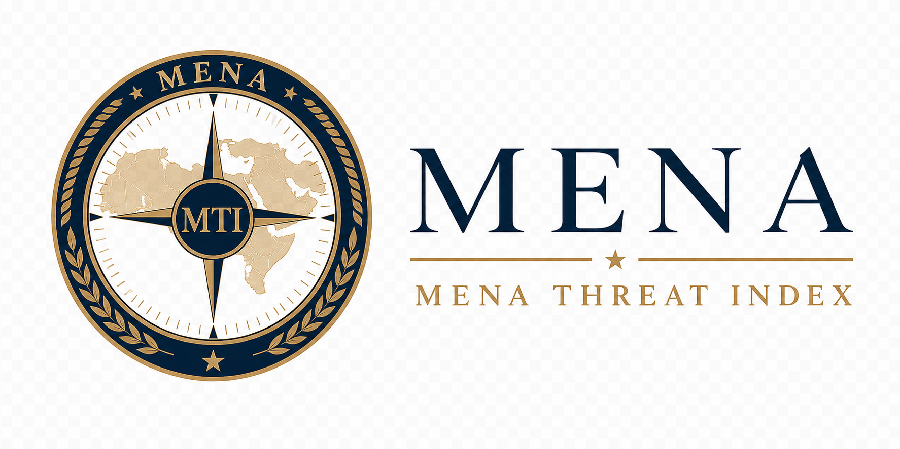

<div align="center">
  
  <!-- CODEX: generate a clean, minimal product logo for "MENA Threat Index" — a stylized regional-risk gauge / compass dial over a faint MENA coastline silhouette, deep navy (#0b1f3a) on transparent, with a single accent arc; corporate, flat, no text or small "MTI" monogram. -->

  # MENA Threat Index

  ### A standing geopolitical-risk assessment for the Middle East and North Africa, refreshed every two hours

  
  
  
  
  

</div>

> **ASSESSMENT · OPEN SOURCE · UNCLASSIFIED**

---

## Executive Summary

The MENA Threat Index (MTI) is a continuously maintained instrument that converts the open news flow of the Middle East and North Africa into a single, auditable geopolitical-risk reading — a 1–10 level for each of twenty-four states and a strategic-weighted regional composite — refreshed every two hours. The Index projects that reading forward and correlates it with global markets — oil, gold, foreign exchange, and defense equities — to characterise how prices respond to regional risk.

MTI is built for analysts, risk officers, and decision-makers who require a repeatable, evidence-backed situational-awareness signal rather than a one-off narrative assessment. It is the successor to the **Border Neighbor Threat Index (BNTI)**, expanded from Türkiye's seven neighbours to the whole of the MENA theatre and rebuilt on a materially improved methodology. Every reading the Index publishes is reproducible, withholdable on failure, and traceable to its source.

## The Assessment

MTI is a **news-frequency geopolitical-risk index**. It measures the volume and severity of regional reporting and renders it as a 1–10 level per country and a strategic-weighted regional composite, then forecasts that signal forward and ties it to observed market behaviour. The Index measures the following:

- **Coverage and depth.** Twenty-four MENA states, ingested from curated outlet feeds and a guaranteed Google News layer, queried in each market's dominant local language alongside pan-regional English feeds.
- **Severity, not noise.** Every headline is mapped to a fixed-weight event category. Per-country scores apply recency decay, source-credibility weighting, and empirical-Bayes shrinkage. Weights never change between runs, so any historical reading can be reconstructed exactly.
- **A forward path with declared uncertainty.** An AR(1) / damped-Holt / persistence ladder projects the smoothed index twenty-four hours ahead with widening 80% predictive intervals.
- **A markets linkage.** The Index computes a lagged "threat beta" for instruments including Brent, WTI, gold, the VIX, the S&P 500, defense and aerospace (ITA), and regional foreign exchange — under false-discovery control, with launch statistics seeded from BNTI.
- **Confidence on every reading.** Each country and the composite carry a 0–1 confidence score combining event volume, source diversity (Shannon entropy), and cross-source corroboration.
- **Discipline before publication.** Runs that fail validation or fall below feed-coverage thresholds are *withheld*: the last known-good snapshot remains live rather than a degraded reading being published.

> **A situational-awareness aid — not a finished intelligence assessment.** The Index reflects the volume and severity of *published reporting*, not ground truth. Coverage is uneven across languages, machine categorization introduces noise, and short-sample correlations are unstable and associative. MTI should be read as a monitoring instrument, not as adjudicated fact.

## Methodology & Provenance

The Company holds to a single first principle — **evidence before assertion**. Every datum the Index publishes carries its source, its collection time, and the method by which it was derived. The processing chain is fixed and inspectable:

```
RSS / Google News (24 countries, multilingual)
        │  feeds.py        fetch · dedupe · 72h window
        ▼
   categorize.py           keyword engine (+ optional NVIDIA LLM)
        ▼
     score.py              recency-decay · source credibility · volume shrinkage
        │                  per-country index  = 1 + 9·(1 − e^(−raw/5·1.2))
        │                  composite          = strategic-weighted mean, EWMA spike-guard
        ▼
   history.py              append reading to data/history.jsonl  (persistent, growing)
        ▼
   forecast.py             AR(1)-with-drift (cold-start ladder) → 24h path + bands
        ▼
   markets.py              Yahoo + FRED prices · lagged correlation · "threat beta"
        │                  · BNTI-seeded · project market moves from forecast path
        ▼
   briefing.py             templated regional summary (+ optional LLM polish)
        ▼
   publish.py              assemble + validate → mena_data.json  (atomic, withhold-on-failure)
```

**Categories and weights.** Each headline is assigned one category corresponding to a fixed severity weight — military conflict 8, terrorism 7, border security 5, political instability 4, humanitarian crisis 3, diplomatic tensions 2.5, trade or de-escalation −2, neutral 0. The fixed-weight design follows established event-data severity scales (Goldstein 1992; CAMEO) and keeps every run auditable.

**Per-country score.** `1 + 9·(1 − e^(−eff/5·1.2))`, where `eff` is a recency-decayed (18-hour half-life), source-credibility-weighted mean event weight, empirically-Bayes shrunk toward the country's trailing baseline. The level reflects **severity, not raw volume**.

**Composite.** A strategic-weighted mean of country scores, smoothed with an asymmetric EWMA — responsive to genuine spikes, resistant to two-hour whipsaw.

**Forecast.** An AR(1) / damped-Holt / persistence ladder applied to the smoothed series, projected twenty-four hours ahead with widening 80% predictive bands.

**Markets.** A lagged "threat beta" per instrument, estimated via the market-model event-study approach and gated by a minimum sample, sign stability, a lag-search correction, and Benjamini–Hochberg false-discovery control. The relationship is reported as **association, not causation**; launch-day statistics are seeded from BNTI and badged as such.

Full formulas, constants, and the academic references behind them reside in `config/settings.yml`, the in-app **Methodology** page, and [`METHODOLOGY_REVIEW.md`](METHODOLOGY_REVIEW.md).

### Provenance on every datum

In keeping with Company doctrine — public sources only, every reading traceable:

- Each event carries its **source**, its **collection window**, its recency-decayed weight, and its source-credibility factor.
- Composite and per-country histories are stored append-only in `data/history.jsonl` and `data/countries/*.jsonl` as the system's source of truth.
- Per-run market snapshots are written to `data/markets/instruments.jsonl`.
- Collection is lawful and open-source only. The optional language-model step reads its key strictly from the environment and never persists it. Runs that fail schema validation or coverage thresholds are withheld, not published.

## Coverage

The Index spans twenty-four states of the Middle East and North Africa, queried in each market's dominant local language alongside pan-regional English-language feeds. Pan-regional outlets — **Al Jazeera, Middle East Eye, The New Arab, Al-Monitor** — are fetched once and attributed to a country only when a headline names it, preventing double-counting across the theatre. Coverage is intentionally broad and explicitly uneven in depth; the confidence score on each reading discloses how thinly or richly any one country is observed in a given run.

### Preview
<!-- CODEX: drop product screenshots into docs/ -->
<!--  (screenshot pending) -->
<!-- CODEX: capture the live app at https://sdcofa.github.io/mena-threat-index/ — the main map view showing the choropleth of MENA countries shaded by threat level, with the regional composite reading and status headline. -->

<!--  (screenshot pending) -->
<!-- CODEX: capture the Markets screen and/or a country-detail panel showing the 24h forecast path with prediction bands and the lagged market-correlation ("threat beta") table. -->

## Data & Sources

| Stream | Provenance |
|---|---|
| **News** | Curated outlet RSS/Atom feeds plus a guaranteed Google News RSS layer, across 24 MENA countries and multiple languages. Pan-regional feeds attributed to a country only when a headline names it. |
| **Markets** | Price series pulled key-free from Yahoo Finance, with FRED fallbacks, for energy, metals, rates, equities, and FX instruments defined in `config/markets.yml`. |
| **History** | Append-only `data/history.jsonl` (composite), `data/countries/*.jsonl` (per-country), `data/markets/instruments.jsonl` (per-run market snapshots) — the system's source of truth. |
| **Seed** | Former BNTI history in `data/seed/`, used to seed launch-day correlations. |

The technical apparatus behind these streams:

- **Pipeline.** Python 3.11 — `feedparser`, `requests`, `numpy`, `pandas`, `PyYAML`. All statistics — AR(1), OLS, Newey–West, correlation, bootstrap — are implemented in NumPy to keep the pipeline lean and CI-robust.
- **Optional language model.** NVIDIA's OpenAI-compatible API (`integrate.api.nvidia.com`, default model `meta/llama-3.3-70b-instruct`) for headline categorization and briefing polish. Entirely optional — the pipeline runs deterministically on the keyword engine when no key is present.
- **Frontend.** A static single-page application — `index.html` plus `support.js`, a self-contained React-based template runtime. No build step, no bundler.
- **Markets data.** Yahoo Finance and FRED, no API key required.
- **Automation.** GitHub Actions — the **MTI Pipeline** workflow (`cron: 0 */2 * * *`, every two hours) recomputes the index, commits `mena_data.json` and `data/`, and deploys Pages.
- **Hosting.** GitHub Pages (static). **Live:** <https://sdcofa.github.io/mena-threat-index/>
- **Testing.** A `pytest` suite covering feeds, categorization, scoring, forecasting, markets, schema, and the frontend data contract.

### Repository layout
| Path | Function |
|---|---|
| `index.html` | The web application (served by GitHub Pages). |
| `support.js` | Template runtime. |
| `mena_data.json` | Latest published snapshot — committed by the pipeline. |
| `config/*.yml` | Countries and feeds, market instruments, category lexicon, settings. |
| `pipeline/*.py` | The data pipeline (run with `python -m pipeline.run`). |
| `data/history.jsonl` | Append-only composite history (source of truth). |
| `data/countries/*.jsonl` | Per-country history. |
| `data/markets/instruments.jsonl` | Per-run market snapshots. |
| `data/seed/` | Former BNTI history, used to seed correlations. |
| `scripts/` | One-off utilities — BNTI seeding, forecast backtest, sensitivity analysis. |
| `.github/workflows/` | Scheduled pipeline and Pages deploy. |
| `tests/` | `pytest` suite. |

## Reproduction

A reading that cannot be re-derived from a clean checkout is a liability. The Index is reproducible end to end.

**Live deployment:** <https://sdcofa.github.io/mena-threat-index/>

### Run the pipeline locally
```bash
pip install -r requirements.txt

# Deterministic run (keyword categorizer, no LLM):
python -m pipeline.run

# With LLM categorization + briefing polish (NVIDIA, OpenAI-compatible API):
export NVIDIA_API_KEY=nvapi-xxxxxxxx        # Windows PowerShell: $env:NVIDIA_API_KEY="nvapi-..."
python -m pipeline.run

# Serve the site:
python -m http.server 8000      # then open http://localhost:8000/
```

`python -m pipeline.run` writes and refreshes `mena_data.json`, appends to `data/`, and **withholds** the update — retaining the last known-good file — if the run fails validation or feed coverage is too low. Run the test suite with `pytest`.

### Deploy (GitHub Pages + Actions)
1. Push this repository and set **Settings → Pages → Build and deployment → Source: GitHub Actions.**
2. *(Optional)* Add `NVIDIA_API_KEY` under **Settings → Secrets and variables → Actions.** The pipeline runs fully without it, on the keyword categorizer.
3. The **MTI Pipeline** workflow runs every two hours (cron), recomputes the index, commits `mena_data.json` and `data/`, and deploys Pages. Trigger it manually via **Actions → MTI Pipeline → Run workflow.**

## Standards

- **Evidence before assertion.** Every reading ships with its source, collection time, and method. No un-provenanced number reaches the dashboard.
- **Lawful, open-source collection only.** Public sources exclusively. The optional NVIDIA key lives solely as a GitHub Actions secret, is read from `NVIDIA_API_KEY` at runtime, and is never written to any file in this repository. Should a key ever be exposed in plaintext, rotate it at <https://build.nvidia.com>.
- **Reproducibility.** The Index reconstructs exactly from a clean checkout; fixed weights and append-only histories guarantee that any past reading can be reproduced.
- **Fail-safe by design.** Degraded runs are withheld rather than published. Silence is preferred to a false signal.
- **Licensed under Apache-2.0** — see [`LICENSE`](LICENSE). © 2026 Monarch Castle Holdings · Ankara, Türkiye.

---

> A standing index of the **Strategic Data Company of Ankara** — a constituent house of [Monarch Castle Holdings](https://github.com/MonarchCastleHoldings). Sister company: [Monarch Castle Technologies](https://github.com/monarchcastletech).

<div align="center"><sub>STRATEGIC DATA COMPANY OF ANKARA · ANKARA · TÜRKİYE · MMXXVI</sub></div>